- [Deploy AMQ Streams Cluster with Ansible](#deploy-amq-streams-cluster-with-ansible)
  - [1 Overall Diagram](#1-overall-diagram)
  - [2 Environment Setup](#2-environment-setup)
    - [2.1 Ansible host](#21-ansible-host)
    - [2.2 AMQ Streams Host information](#22-amq-streams-host-information)
      - [Broker and Zookeeper](#broker-and-zookeeper)
    - [Additional component](#additional-component)
    - [2.3 Host SSH Credential](#23-host-ssh-credential)
    - [2.4 Generate SSL Key for AMQ Streams](#24-generate-ssl-key-for-amq-streams)
    - [2.5 Cluster configuration](#25-cluster-configuration)
    - [2.6 Ansible Vault for Sensitive data encryption](#26-ansible-vault-for-sensitive-data-encryption)
    - [2.7 Runing ansible-playbook with encrypted file included](#27-runing-ansible-playbook-with-encrypted-file-included)
  - [3 Provisioning AMQ Streams virtual machines](#3-provisioning-amq-streams-virtual-machines)
  - [4 Deploy AMQ Stream](#4-deploy-amq-stream)
    - [4.1 Application package deployment](#41-application-package-deployment)
    - [4.2 Hosts file update](#42-hosts-file-update)
    - [4.2 Configure Kafka Parameter](#42-configure-kafka-parameter)
    - [4.4 Change SELinux Context](#44-change-selinux-context)
    - [4.5 Start Zookeeper and Broker Service](#45-start-zookeeper-and-broker-service)
  - [5 Client node provisioning and installation](#5-client-node-provisioning-and-installation)
    - [5.1 Client node provisioning](#51-client-node-provisioning)
    - [5.2 Install Client](#52-install-client)
    - [5.2 Create Test Topic](#52-create-test-topic)
  - [6 Monitor node](#6-monitor-node)
    - [6.1 Monitor node provisioning](#61-monitor-node-provisioning)
    - [6.2 Monitor node deployment](#62-monitor-node-deployment)
    - [6.3 Import dashboard to grafana dashboard](#63-import-dashboard-to-grafana-dashboard)

# Deploy AMQ Streams Cluster with Ansible

## 1 Overall Diagram
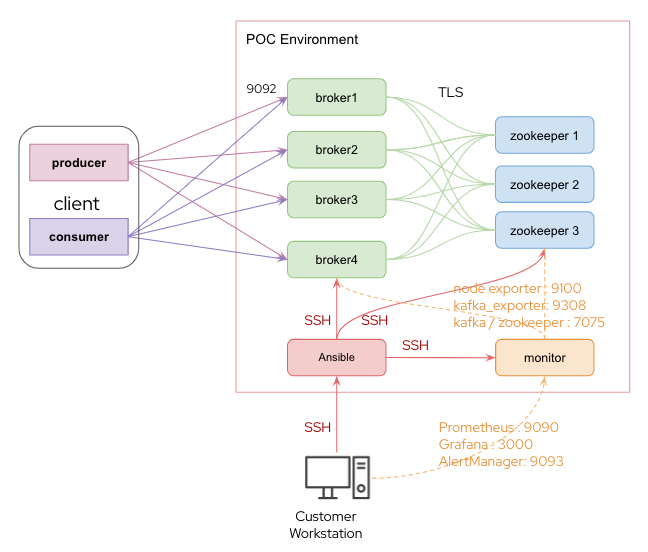  
Ansible script targeted to deploy
- AMQ Streams with 3-4 node Kafka broker cluster, 3 node zookeeper
- Dedicated 1 node for Kafka client test
- Set up monitoring node for performance monitoring
- Schema Registry hosted on Red Hat OpenShift

## 2 Environment Setup
### 2.1 Ansible host

Create RHEL 8.5 VM and install ansible package or use [Other OS](https://docs.ansible.com/ansible/latest/installation_guide/intro_installation.html)
- install ansible package for RHEL
```bash
sudo yum install ansible
```
If you need ansible to provisioning AMQ Streams VMs on vsphere , install GOVC package (otherwise please deploy all node manually)

```bash
# extract govc binary to /usr/local/bin
# note: the "tar" command must run with root permissions
$ curl -L -o - "https://github.com/vmware/govmomi/releases/latest/download/govc_$(uname -s)_$(uname -m).tar.gz" | tar -C /usr/local/bin -xvzf - govc
```

reference : https://github.com/vmware/govmomi/tree/master/govc

Test GOVC Function with "govc ls"

```bash
$ export GOVC_USERNAME=ESXI_OR_VCENTER_USERNAME
$ export GOVC_PASSWORD=ESXI_OR_VCENTER_PASSWORD
$ export GOVC_URL=https://ESXI_OR_VCENTER_HOSTNAME:443
$ govc ls
/RedHat/vm
/RedHat/network
/RedHat/host
/RedHat/datastore
```

modified invetory/group_vars/ansible.yml to match with your vsphere environment
```yml
---
vcenter_hostname: "172.16.15.28"
vcenter_username: "administrator@vsphere.local"
vcenter_password: "********"
datacenter: "RedHat"
validate_certs: False
folder: "amq_streams"
monitor_folder: "amq_monitor"
kafka_exporter_folder: "amq_exporter"
client_folder: "amq_client"
gateway: "192.168.0.1"
dns: "192.168.3.32"
netmask: "255.255.252.0"
external_netmask: "255.255.255.0"
external_gateway: "172.16.15.254"
nic_pg: "Internal Network 101"
rhel_image: "rhel7_image"
```
Create master image for RHEL8.5 (basic install) , convert to template 

minimum specification

vCPU : 4

Memory : 4 GB ( recommended 8 or higher)

Disk : 50 GB

OS : RHEL 8.5 basic install (with or without GUI)

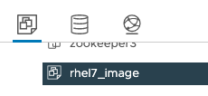  


### 2.2 AMQ Streams Host information
Before running ansible script to deploy AMQ Streams , DNS records , hostname and IP address need to be assignned to intventory/inventory.ini file. Modified informantion to match with your environment accordingly 

if you choose to provisioning VMs by ansible , modified inventory.ini first, ansible will read data from inventory and create VM based on parameter in inventory( hostname, ip address)
#### Broker and Zookeeper

```ini
[broker]
broker1.rhdemo.local ip_address="192.168.2.51" name="broker1" id='0'
broker2.rhdemo.local ip_address="192.168.2.52" name="broker2" id='1'
broker3.rhdemo.local ip_address="192.168.2.53" name="broker3" id='2'

[zookeeper]
zkeeper1.rhdemo.local ip_address="192.168.2.55" name="zkeeper1" id='1'
zkeeper2.rhdemo.local ip_address="192.168.2.56" name="zkeeper2" id='2'
zkeeper3.rhdemo.local ip_address="192.168.2.57" name="zkeeper3" id='3'
```

### Additional component 

Kafka client : install required packaged to run producer and comsumer including add all required local hosts file and authentication information

Monitor : install monitoring stack for AMQ streams including Alert Manager, Grafana, Prometheus( standalone )

Kafka_exporter : dedicated VM for hosting Kafka exporter ( for Grafana dashboard)

```ini
[kafka_client]
kafka-client1.rhdemo.local ip_address="192.168.2.61" name="kafka-client1"
kafka-client2.rhdemo.local ip_address="192.168.2.62" name="kafka-client2"

[monitor]
monitor.rhdemo.local ip_address="192.168.2.71" name="monitor"

[kafka_exporter]
exporter.rhdemo.local ip_address="192.168.2.73" name="exporter"
```


### 2.3 Host SSH Credential
In this script using basic SSH authentication, change user and password in inventory/inventory.ini before running deployment script
```ini
[all:vars]
ansible_connection=ssh
ansible_user=root
ansible_ssh_pass='********'
ansible_ssh_common_args='-o StrictHostKeyChecking=no'
ansible_sudo_pass='********'
```

### 2.4 Generate SSL Key for AMQ Streams
SSL key tasks target :
Generate set of JKS file including truststore and keystore for each hosts for demo

Procedure
- Logon to Ansible node 
- Install Java JDK 11
- Copy script directory from git repository to /home/mqm/amq-stream-ansible
- Go to amq-streams-ansible/scripts
- Export necessary parameter , in HOST_IP_LIST => add  all broker , zookeeper and client
```bash
export COUNTRY="TH"
export STATE="Bangkok"
export LOCATION="RH"
export ORGANIZATION="RH"
export ORGANIZATION_UNIT="RH"
export DOMAIN_NAME="rhdemo.local"
export HOST_IP_LIST="broker1:192.168.2.51;broker2:192.168.2.52;broker3:192.168.2.53;zkeeper1:192.168.2.55;zkeeper2:192.168.2.56;zkeeper3:192.168.2.57;kafka-client1:192.168.2.61;kafka-client2:192.168.2.62;"
```
- Run scrip
```bash
.\ssl_generator.sh regular
```

- Wait for shell to finish , verified keys for each host and truststore file are stored in /scripts/kafka-ssl/

```bash
[redhat@ansible-ws scripts]$ ll kafka-ssl/
total 76
-rw-rw-r--. 1 redhat redhat 7627 Apr 22 14:31 broker1.keystore.jks
-rw-rw-r--. 1 redhat redhat 7627 Apr 22 14:31 broker2.keystore.jks
-rw-rw-r--. 1 redhat redhat 7627 Apr 22 14:32 broker3.keystore.jks
-rw-rw-r--. 1 redhat redhat 2037 Apr 22 14:31 ca.crt
-rw-------. 1 redhat redhat 3272 Apr 22 14:31 ca.key
-rw-rw-r--. 1 redhat redhat 7671 Apr 22 14:32 kafka-client1.keystore.jks
-rw-rw-r--. 1 redhat redhat 7671 Apr 22 14:32 kafka-client2.keystore.jks
-rw-rw-r--. 1 redhat redhat 1831 Apr 22 14:31 truststore.jks
-rw-rw-r--. 1 redhat redhat 7645 Apr 22 14:32 zkeeper1.keystore.jks
-rw-rw-r--. 1 redhat redhat 7645 Apr 22 14:32 zkeeper2.keystore.jks
-rw-rw-r--. 1 redhat redhat 7645 Apr 22 14:32 zkeeper3.keystore.jks
[redhat@ansible-ws scripts]$ 

```
### 2.5 Cluster configuration

Change configuration in inventory/group_vars/all.yml to match you environment ( all file name in list are in repository)
```yaml
---
sudoer: root
domain: "rhdemo.local"

amq_installation_file: "amq-streams-1.8.4-bin.zip"
prometheus_installation_file: "prometheus-2.32.1.linux-amd64.tar.gz"
prometheus_installation_directory: "prometheus-2.32.1.linux-amd64"
grafana_installation_file: "grafana-8.3.3-1.x86_64.rpm"
alertmanager_installation_file: "alertmanager-0.23.0.linux-amd64.tar.gz"
alertmanager_installation_directory: "alertmanager-0.23.0.linux-amd64"

kafka_user: "kafka"
kafka_password: "kafka"
kafka_group: "kafka"
kafka_path: "/kafka"
kafka_data_path: "/kafka_data"
kafka_log_path: "/kafka_log"
kafka_tmp_path: "/kafka_tmp"
kafka_app_path: "/app"
```

### 2.6 Ansible Vault for Sensitive data encryption

If sensitive data require encryption , apply ansible vault for sensitive data encryption by

remove all password, credential related information from inventory/inventory.ini

```


```

Change inventory group_vars structure to support multiple variable files per group

From file base variable file ( reference by file name to group name)
```
inventory/
├── group_vars
│   ├── all.yml
│   └── ansible.yml
└── inventory.ini
```
To directory base variable ( reference by directory name to group name)

var.yml : contain non-sensitive variable

vault.yml : contain sensitive variable


```
inventory/
├── group_vars
│   ├── amq
│   │   ├── vars.yml
│   │   └── vault.yml
│   └── ansible
│       └── vault.yml
└── inventory.ini
```

vars.yml content example
```
---
ansible_connection: ssh
domain: "rhdemo.local"

amq_installation_file: "amq-streams-1.8.4-bin.zip"
prometheus_installation_file: "prometheus-2.32.1.linux-amd64.tar.gz"
prometheus_installation_directory: "prometheus-2.32.1.linux-amd64"
grafana_installation_file: "grafana-8.3.3-1.x86_64.rpm"
alertmanager_installation_file: "alertmanager-0.23.0.linux-amd64.tar.gz"
alertmanager_installation_directory: "alertmanager-0.23.0.linux-amd64"

kafka_user: "kafka"
kafka_password: "kafka"
kafka_group: "kafka"
kafka_path: "/kafka"
kafka_data_path: "/kafka_data"
kafka_log_path: "/kafka_log"
kafka_tmp_path: "/kafka_tmp"
```

vault.yml file content example

```
sudoer: root
ansible_ssh_pass: '**********'
ansible_ssh_common_args: '-o StrictHostKeyChecking=no'
ansible_sudo_pass: '**********'
```

Encrypt all vault.yml , input password for encryption and confirm

```
ansible-vault encrypt inventory/group_vars/amq/vault.yml
New Vault password: ******
Confirm New Vault password: ******

ansible-vault encrypt inventory/group_vars/ansible/vault.yml
New Vault password: ******
Confirm New Vault password: ******

```

Confirm vault.yml content are encrypted
```bash
[redhat@ansible-ws amq-stream-ansible]$ cat inventory/group_vars/amq/vault.yml 
$ANSIBLE_VAULT;1.1;AES256
62313031643738646265373261633430393862633363623839396537616134353565333031376137
6236613336323238326463303934626563323765383763320a626535363563373264366338356238
64623864323335653061313734376534343431336339316661346233336665363734666163336437
6434356437346434320a366330343033336134643761396664383639383238666462646630373964
66613734336437353337383736343033323965373731626439393238353238353638386163333938
63633662656466323764656132363362636133633966393433313865306136316137643466306636
65376461366366343733346532393034633463373630333734633737303232323339396338383965
66373234323238663861376466333963623139366537626363323361383036326562376534336537
30623161636537313831613738333363313635396661303332616631343830356234323335363834
6336636564633363363237643238646233623331633839653132
[redhat@ansible-ws amq-stream-ansible]$ 
```

Test read vault.yml content with password input

```
[redhat@ansible-ws amq-stream-ansible]$ ansible-vault view inventory/group_vars/amq/vault.yml 
Vault password: 
sudoer: root
ansible_ssh_pass: '********'
ansible_ssh_common_args: '-o StrictHostKeyChecking=no'
ansible_sudo_pass: '********'

```

### 2.7 Runing ansible-playbook with encrypted file included

Option 1 : Every ansible-playbook command run , included '--ask-vault-pass' in command ( you need to input vault password interactively)
```
[redhat@ansible-ws amq-stream-ansible]$ ansible-playbook -i inventory/inventory.ini --ask-vault-pass playbook/13_restart_kafka.yml
Vault password: 

PLAY [retart kafka services] *****************************************************************************************

TASK [Force systemd to reread configs] *******************************************************************************
ok: [broker3.rhdemo.local]
ok: [broker2.rhdemo.local]
ok: [broker1.rhdemo.local]

TASK [Restart Kafka] *************************************************************************************************
changed: [broker1.rhdemo.local]
changed: [broker3.rhdemo.local]
changed: [broker2.rhdemo.local]

PLAY RECAP ***********************************************************************************************************
broker1.rhdemo.local       : ok=2    changed=1    unreachable=0    failed=0    skipped=0    rescued=0    ignored=0   
broker2.rhdemo.local       : ok=2    changed=1    unreachable=0    failed=0    skipped=0    rescued=0    ignored=0   
broker3.rhdemo.local       : ok=2    changed=1    unreachable=0    failed=0    skipped=0    rescued=0    ignored=0 
```

Option 2 (Easier but not recommended, use for dev only) : Create temp vault pass file in path that you will execute ansible-playbook command

```
echo '<<vault password>>' > .vault_pass

export ANSIBLE_VAULT_PASSWORD_FILE=./.vault_pass
```

run playbook without additional parameter

```
[redhat@ansible-ws amq-stream-ansible]$ ansible-playbook -i inventory/inventory.ini  playbook/13_restart_kafka.yml

PLAY [retart kafka services] *****************************************************************************************

TASK [Force systemd to reread configs] *******************************************************************************
ok: [broker3.rhdemo.local]
ok: [broker2.rhdemo.local]
ok: [broker1.rhdemo.local]

TASK [Restart Kafka] *************************************************************************************************
changed: [broker1.rhdemo.local]
changed: [broker2.rhdemo.local]
changed: [broker3.rhdemo.local]

PLAY RECAP ***********************************************************************************************************
broker1.rhdemo.local       : ok=2    changed=1    unreachable=0    failed=0    skipped=0    rescued=0    ignored=0   
broker2.rhdemo.local       : ok=2    changed=1    unreachable=0    failed=0    skipped=0    rescued=0    ignored=0   
broker3.rhdemo.local       : ok=2    changed=1    unreachable=0    failed=0    skipped=0    rescued=0    ignored=0
```

## 3 Provisioning AMQ Streams virtual machines

run ansible playbook no. 00 to create AMQ Streams VMs and folder in vSphere

```bash
ansible-playbook -i inventory/inventory.ini playbook/00_create_vm.yml 
```

```bash
[redhat@ansible-ws amq-stream-ansible]$ ansible-playbook -i inventory/inventory.ini playbook/00_create_vm.yml 

PLAY [Create vSphere resource for AMQ Streams] **********************************************************************************************************************************************************************************

TASK [Create a VM folder on datacenter] *****************************************************************************************************************************************************************************************
ok: [localhost -> localhost]

TASK [Create a virtual machine on ESXi] *****************************************************************************************************************************************************************************************
changed: [localhost -> localhost] => (item=broker1.rhdemo.local)
changed: [localhost -> localhost] => (item=broker2.rhdemo.local)
changed: [localhost -> localhost] => (item=broker3.rhdemo.local)
changed: [localhost -> localhost] => (item=zkeeper1.rhdemo.local)
changed: [localhost -> localhost] => (item=zkeeper2.rhdemo.local)
changed: [localhost -> localhost] => (item=zkeeper3.rhdemo.local)

PLAY RECAP **********************************************************************************************************************************************************************************************************************
localhost                  : ok=2    changed=1    unreachable=0    failed=0    skipped=0    rescued=0    ignored=0 
```

confirm output

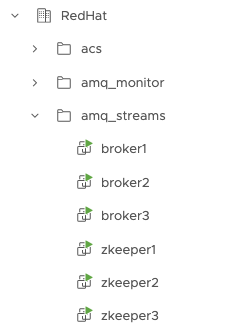  

## 4 Deploy AMQ Stream

### 4.1 Application package deployment
Application deployment playbook target :

- Copy Kafka application packages to related node at /kafka_tmp
- Extract file from /kafka_tmp to /kafka
- Ensure “kafka” user exists and have right privilege for kafka process
- Install required java JDK if needed ( jdk 11 devel)

Tasks Diagram

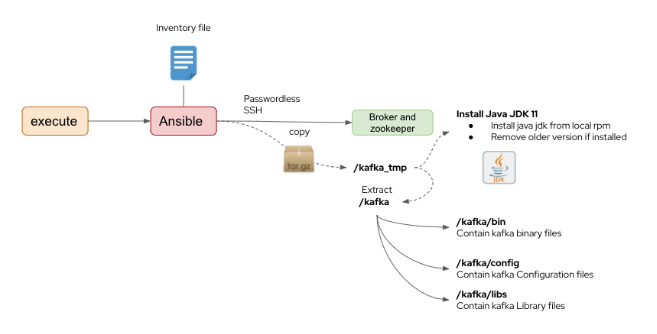  

Procedure
- Logon to Ansible nodes 
- Confirm variable in inventory/group_vars/all.yml
```ini
kafka_path: "/kafka"
kafka_data_path: "/kafka_data"
kafka_log_path: "/kafka_log"
kafka_tmp_path: "/kafka_tmp"
kafka_app_path: "/app"
```
- Run playbook on ansible node
```bash
ansible-playbook  -i inventory/inventory.ini playbook/01_app_deploy.yml
```


```bash
[redhat@ansible-ws amq-stream-ansible]$ ansible-playbook  -i inventory/inventory.ini playbook/01_app_deploy.yml

PLAY [Create Kafka user and group] **********************************************************************************************************************************************************************************************

TASK [Add Kafka group] **********************************************************************************************************************************************************************************************************
changed: [zkeeper2.rhdemo.local]
changed: [broker3.rhdemo.local]
changed: [zkeeper1.rhdemo.local]
changed: [broker1.rhdemo.local]
changed: [broker2.rhdemo.local]
changed: [zkeeper3.rhdemo.local]

....

PLAY RECAP **********************************************************************************************************************************************************************************************************************
broker1.rhdemo.local       : ok=16   changed=14   unreachable=0    failed=0    skipped=0    rescued=0    ignored=0   
broker2.rhdemo.local       : ok=16   changed=14   unreachable=0    failed=0    skipped=0    rescued=0    ignored=0   
broker3.rhdemo.local       : ok=16   changed=14   unreachable=0    failed=0    skipped=0    rescued=0    ignored=0   
zkeeper1.rhdemo.local      : ok=16   changed=14   unreachable=0    failed=0    skipped=0    rescued=0    ignored=0   
zkeeper2.rhdemo.local      : ok=16   changed=14   unreachable=0    failed=0    skipped=0    rescued=0    ignored=0   
zkeeper3.rhdemo.local      : ok=16   changed=14   unreachable=0    failed=0    skipped=0    rescued=0    ignored=0
```

### 4.2 Hosts file update
Hosts file update  playbook target :
- Dynamically update /etc/hosts for Kafka and Zookeeper node to reference hostname matching TLS key

Task Diagram
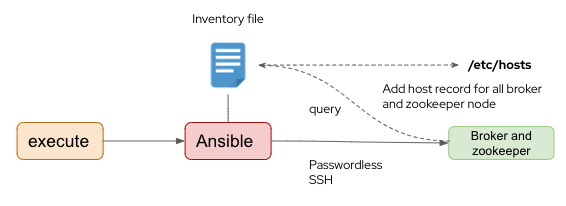  

Procedure
- Logon to Ansible nodes 
- Run playbook on ansible node
```bash
ansible-playbook  -i inventory/inventory.ini playbook/02_dns.yml
```

- ssh to broker node , check /etc/hosts file

```bash
[redhat@broker1 ~]$ cat /etc/hosts
127.0.0.1   localhost localhost.localdomain localhost4 localhost4.localdomain4
::1         localhost localhost.localdomain localhost6 localhost6.localdomain6

192.168.2.51  broker1
192.168.2.52  broker2
192.168.2.53  broker3
192.168.2.55  zkeeper1
192.168.2.56  zkeeper2
192.168.2.57  zkeeper3
```

### 4.2 Configure Kafka Parameter
Configure kafka parameter playbook target :
- Copy necessary files for Kafka and Zookeeper cluster, configure parameter by using inventory environment as reference
- Configure Kafka broker connection to Zookeeper cluster
- Configure server-to-server authentication
- Start service or restart service when required
- Install node_exporter on each host for monitoring performance metric with prometheus

Task Diagram
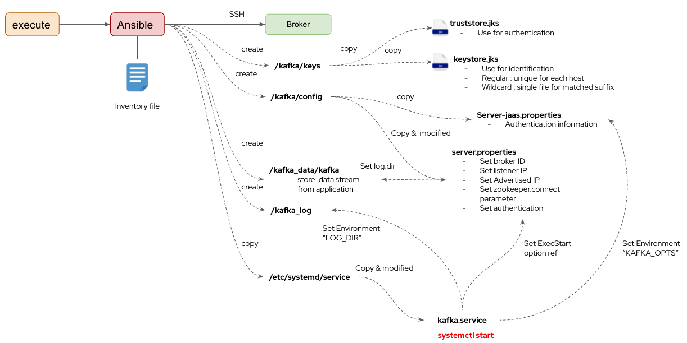  

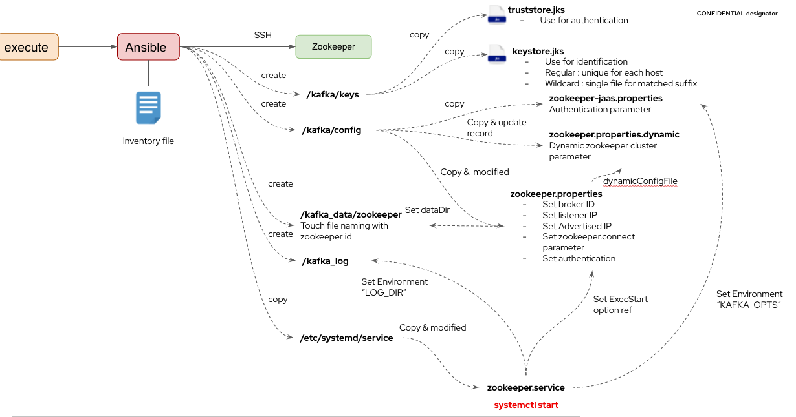  


Procedure
- Logon to Ansible nodes 
- Run playbook on ansible node
```bash
ansible-playbook  -i inventory/inventory.ini playbook/03_configure.yml
```

Configuration Artifact 

All node:
Truststore and key jks file copied to /kafka/keys
```bash
[redhat@broker1 ~]$ ll /kafka/keys/
total 12
-rw-r--r--. 1 kafka kafka 7627 Apr 22 16:04 keystore.jks
-rw-r--r--. 1 kafka kafka 1831 Apr 22 16:04 truststore.jks
[redhat@broker1 ~]$ 
```

Broker  node :
broker id configured in /kafka/config/server.properties as reference in inventory files
```
[redhat@broker1 ~]$ cat /kafka/config/server.properties  | grep broker.id
broker.id=0
[redhat@broker1 ~]$ 
```

Broker  node :
In /kafka/config/server.properties 
zookeeper.connect parameter configure with all zookeeper node in cluster

```sh
[redhat@broker1 ~]$ cat /kafka/config/server.properties  | grep zookeeper.connect
zookeeper.connect=zkeeper1:2182,zkeeper2:2182,zkeeper3:2182
zookeeper.connection.timeout.ms=18000
[redhat@broker1 ~]$ 
```

Broker node:
In /kafka/config/server.properties 
SASL authentication enabled

```
[redhat@broker1 ~]$ cat /kafka/config/server.properties  | grep sasl
sasl.enabled.mechanisms=PLAIN
sasl.mechanism.inter.broker.protocol=PLAIN
[redhat@broker1 ~]$ 
```

Broker node:
Kafka.service are copied to /etc/systemd/system/

```
[redhat@broker1 ~]$ ls /etc/systemd/system | grep kafka
kafka.service
```

### 4.4 Change SELinux Context

RHEL 8 with custom execution path required selinux context modification 

run ansible playbook
```bash
ansible-playbook -i inventory/inventory.ini playbook/04_selinux.yml
```


### 4.5 Start Zookeeper and Broker Service 

run ansible playbook
```bash
ansible-playbook -i inventory/inventory.ini playbook/05_start_service.yml
```

Broker node:
Kafka service status running

```shell
[redhat@broker1 ~]$ systemctl status kafka
● kafka.service - Red Hat AMQ Streams (Kafka service)
   Loaded: loaded (/etc/systemd/system/kafka.service; enabled; vendor preset: disabled)
   Active: active (running) since Fri 2022-04-22 16:04:52 +07; 10min ago
     Docs: http://kafka.apache.org/documentation.html
 Main PID: 9866 (java)
    Tasks: 86
   Memory: 1.0G
   CGroup: /system.slice/kafka.service
           └─9866 java -Xmx1G -Xms1G -server -XX:+UseG1GC -XX:MaxGCPauseMillis=20 -XX:InitiatingHeapOccupancyPercent=35 -XX:+ExplicitGCInvokesConcurrent -XX:MaxInlineLevel=15 -Djava.awt.headle...
```

Zookeeper node: zookeeper id in zookeeper id list in /kafka_data/zookeeper/myid

```
[redhat@zkeeper1 ~]$ cat /kafka_data/zookeeper/myid 
1[redhat@zkeeper1 ~]$ 
[redhat@zkeeper1 ~]$ 
```

Zookeeper node:
In /kafka/config/zookeeper.properties.dynamic configured with all zookeeper node records

```
[redhat@zkeeper1 ~]$ cat /kafka/config/zookeeper.properties.dynamic
...
server.1=zkeeper1:2888:3888:participant;zkeeper1:2181
server.2=zkeeper2:2888:3888:participant;zkeeper2:2181
server.3=zkeeper3:2888:3888:participant;zkeeper3:2181
...
```

Zookeeper node:In /kafka/config/zookeeper.properties set quorum.auth.enableSasl=true
```console
[redhat@zkeeper1 ~]$ cat /kafka/config/zookeeper.properties | grep Sasl
quorum.auth.serverRequireSasl=true
quorum.auth.learnerRequireSasl=true
quorum.auth.enableSasl=true
[redhat@zkeeper1 ~]$ 
```

Zookeeper node: Zookeeper service status running

```
[redhat@zkeeper1 ~]$ systemctl status zookeeper
● zookeeper.service - Red Hat AMQ Streams (Zookeeper service)
   Loaded: loaded (/etc/systemd/system/zookeeper.service; enabled; vendor preset: disabled)
   Active: active (running) since Fri 2022-04-22 16:04:52 +07; 16min ago
     Docs: http://zookeeper.apache.org
 Main PID: 9455 (java)
    Tasks: 52
   Memory: 378.1M
   CGroup: /system.slice/zookeeper.service
           └─9455 java -Xmx512M -Xms512M -server -XX:+UseG1GC -XX:MaxGCPauseMillis=20 -XX:InitiatingHeapOccupancyPercent=35 -XX:+ExplicitGCInvokesConcurrent -XX:MaxInlineLevel=15 -Djava.awt.he...

```

All node:
Node_exporter service status running

```
[redhat@broker1 ~]$ systemctl status node_exporter
● node_exporter.service - node_exporter
   Loaded: loaded (/etc/systemd/system/node_exporter.service; enabled; vendor preset: disabled)
   Active: active (running) since Fri 2022-04-22 16:04:50 +07; 16min ago
 Main PID: 9750 (node_exporter)
    Tasks: 8
   Memory: 12.8M
   CGroup: /system.slice/node_exporter.service
           └─9750 /kafka/bin/node_exporter

```


All node:
Curl http://<< node IP >>:7075 providing metrics

```
[redhat@broker1 ~]$ curl localhost:7075 | head -n 10
  % Total    % Received % Xferd  Average Speed   Time    Time     Time  Current
                                 Dload  Upload   Total   Spent    Left  Speed
  0  373k    0     0    0     0      0      0 --:--:-- --:--:-- --:--:--     0# HELP jvm_info VM version info
# TYPE jvm_info gauge
jvm_info{runtime="OpenJDK Runtime Environment",vendor="Oracle Corporation",version="11.0.8+10-LTS",} 1.0
# HELP jmx_config_reload_failure_total Number of times configuration have failed to be reloaded.
# TYPE jmx_config_reload_failure_total counter
jmx_config_reload_failure_total 0.0
# HELP process_cpu_seconds_total Total user and system CPU time spent in seconds.
# TYPE process_cpu_seconds_total counter
process_cpu_seconds_total 79.2
# HELP process_start_time_seconds Start time of the process since unix epoch in seconds.
 16  373k   16 61184    0     0  82154      0  0:00:04 --:--:--  0:00:04 82126
curl: (23) Failed writing body (256 != 16384)
```

## 5 Client node provisioning and installation 

### 5.1 Client node provisioning

Run playbook

```ini
ansible-playbook  -i inventory/inventory.ini playbook/81_create_client_vm.yml
```

```
[redhat@ansible-ws amq-stream-ansible]$ ansible-playbook  -i inventory/inventory.ini playbook/81_create_client_vm.yml 

PLAY [Create vSphere resource for AMQ Stream] *****************************************************************************************************************************************************

TASK [Create a VM folder on datacenter] ***********************************************************************************************************************************************************
ok: [localhost -> localhost]

TASK [Create a virtual machine on ESXi] ***********************************************************************************************************************************************************
ok: [localhost -> localhost] => (item=kafka-client1.rhdemo.local)

PLAY RECAP ****************************************************************************************************************************************************************************************
localhost                  : ok=2    changed=0    unreachable=0    failed=0    skipped=0    rescued=0    ignored=0 
```

### 5.2 Install Client
Client node installation  playbook target :
- Copy Kafka application packages to related node at /kafka_tmp
- Extract file from /kafka_tmp to /kafka
- Ensure “mqm” user exists and have right privilege for kafka process
- Install required java JDK if needed ( jdk 11 devel)

Task Diagram

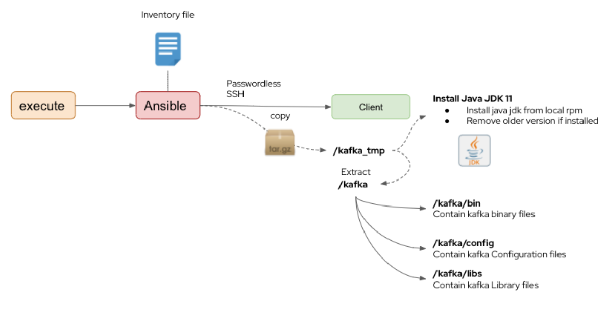  

Procedure

- Run Playbook
```
ansible-playbook  -i inventory/inventory.ini playbook/82_install_kafka_client.yml
```

### 5.2 Create Test Topic

Sample of test topic command are in scripts/command.sh

- Create Topic
```
[redhat@kafka-client1 ~]$ /opt/redhat-amq-streams/bin/kafka-topics.sh --create \
> --bootstrap-server broker1:9092,broker2:9092,broker3:9092 \
> --command-config /opt/redhat-amq-streams/config/client.properties  \
> --replication-factor 3 \
> --partitions 3 \
> --topic perf-test
Created topic perf-test.
[redhat@kafka-client1 ~]$ 
```

- Producer Test
```
[redhat@kafka-client1 ~]$ /opt/redhat-amq-streams/bin/kafka-producer-perf-test.sh \
> --topic perf-test \
> --num-records 5000000 \
> --record-size 2000 \
> --throughput -1 \
> --producer.config /opt/redhat-amq-streams/config/client.properties \
> --producer-props acks=1 bootstrap.servers=broker1:9092,broker2:9092,broker3:9092
152897 records sent, 30567.2 records/sec (58.30 MB/sec), 455.2 ms avg latency, 1564.0 ms max latency.
342350 records sent, 68470.0 records/sec (130.60 MB/sec), 237.4 ms avg latency, 749.0 ms max latency.
440607 records sent, 88121.4 records/sec (168.08 MB/sec), 186.8 ms avg latency, 627.0 ms max latency.
```

## 6 Monitor node
### 6.1 Monitor node provisioning
As this Demo required node performance measurement, monitoring node installed as additional resource for that purpose.

Pocedure
- Run Playbook
  ```
  ansible-playbook  -i inventory/inventory.ini playbook/71_create_prometheus_vm.yml 
  ```
- Confirm monitor vm created under monitor folder
  

### 6.2 Monitor node deployment

Criteria for this part is to confirm monitoring node can provide performance resource dashboard for kafka and server related metric as we already configure metric export for each node in earlier step
Monitoring node will deployed
- Prometheus
- Alertmanager
- Grafana-server
- Kafka-exporter

Task Diagram
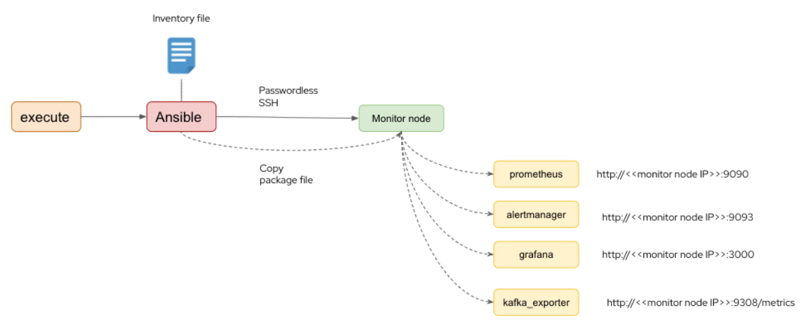  

Procedure
- Run Playbook in sequence
  ```
  ansible-playbook  -i inventory/inventory.iniplaybook/72_deploy_prometheus.yml
  ansible-playbook  -i inventory/inventory.iniplaybook/73_deploy_alertmanager.yml
  ansible-playbook  -i inventory/inventory.iniplaybook/74_deploy_grafana.yml
  ansible-playbook  -i inventory/inventory.iniplaybook/75_deploy_kafka_exporter.yml
  ```
- Verify all tasks done successfully without errors
- Add Prometheus data source to Grafana
- Open URL from browser http://<< monitor-node >>:3000 
  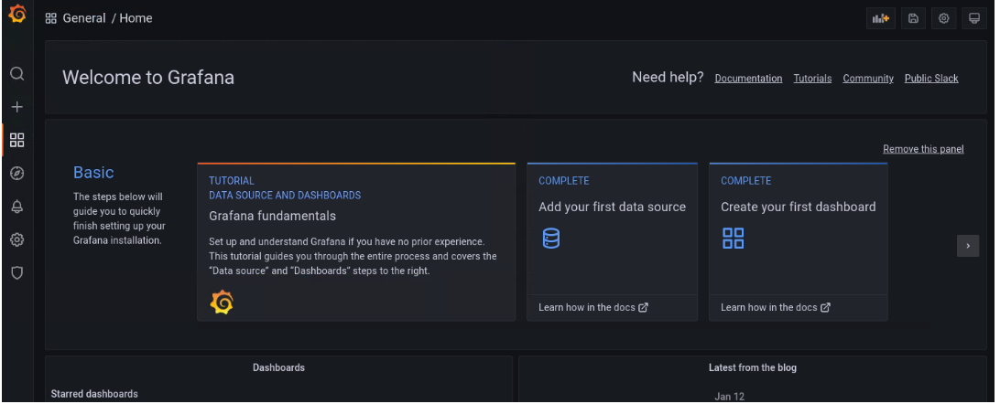  
- Hold over  setting icon  , select “Data sources”
  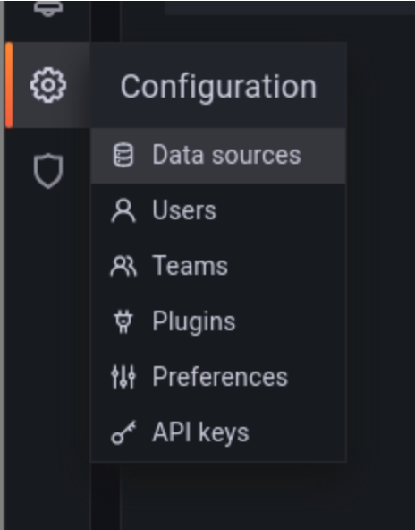  
- Click “Add data source”
    
- select "Prometheus"
  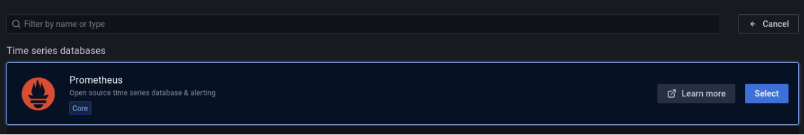  
- In HTTP URL , input “http://localhost:9090” , click “Save & Test”
  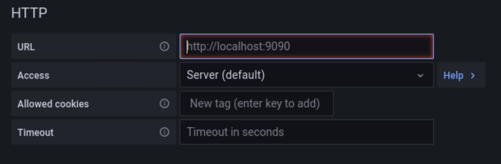  

### 6.3 Import dashboard to grafana dashboard
- Hold over “+” sign , select “import”
  
  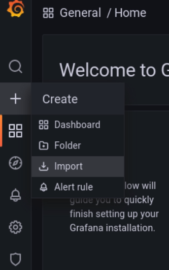  
  
- Copy content from amq-stream-ansible/files/kafka-cluster.json to json panel , click “Load”
  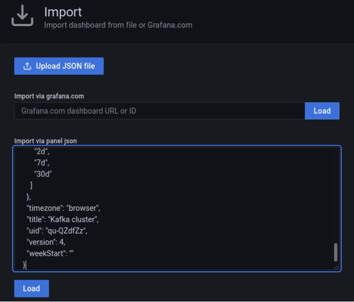
- In prometheus select  “Prometheus (default)” , then click “Import”
    
- Repeat step for
  - “zookeeper-cluster.json”
  - “node-exporter-full_rev24.json”
  - “kafka-exporter.json”
- Confirm dashboard appear at browse page to be selected
  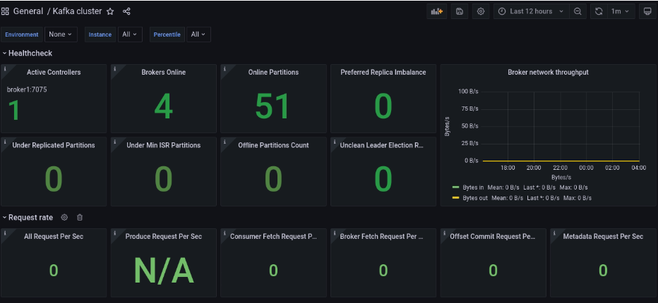  